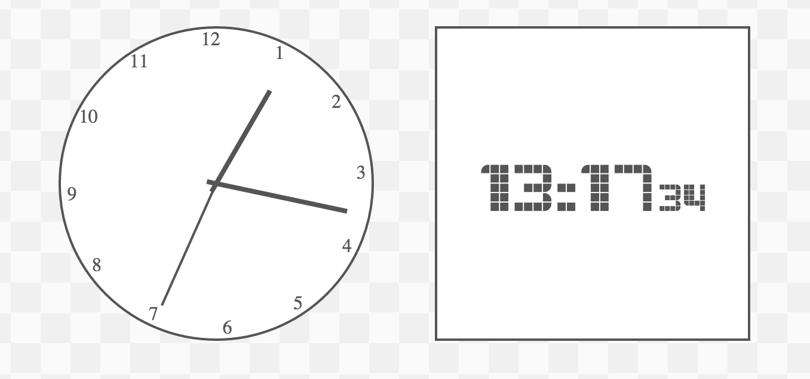

apeman-react-clock
==========

<!---
This file is generated by ape-tmpl. Do not update manually.
--->

<!-- Badge Start -->
<a name="badges"></a>

[![Build Status][bd_travis_shield_url]][bd_travis_url]
[![Code Climate][bd_codeclimate_shield_url]][bd_codeclimate_url]
[![Code Coverage][bd_codeclimate_coverage_shield_url]][bd_codeclimate_url]
[![npm Version][bd_npm_shield_url]][bd_npm_url]

[bd_repo_url]: https://github.com/apeman-react-labo/apeman-react-clock
[bd_travis_url]: http://travis-ci.org/apeman-react-labo/apeman-react-clock
[bd_travis_shield_url]: http://img.shields.io/travis/apeman-react-labo/apeman-react-clock.svg?style=flat
[bd_license_url]: https://github.com/apeman-react-labo/apeman-react-clock/blob/master/LICENSE
[bd_codeclimate_url]: http://codeclimate.com/github/apeman-react-labo/apeman-react-clock
[bd_codeclimate_shield_url]: http://img.shields.io/codeclimate/github/apeman-react-labo/apeman-react-clock.svg?style=flat
[bd_codeclimate_coverage_shield_url]: http://img.shields.io/codeclimate/coverage/github/apeman-react-labo/apeman-react-clock.svg?style=flat
[bd_gemnasium_url]: https://gemnasium.com/apeman-react-labo/apeman-react-clock
[bd_gemnasium_shield_url]: https://gemnasium.com/apeman-react-labo/apeman-react-clock.svg
[bd_npm_url]: http://www.npmjs.org/package/apeman-react-clock
[bd_npm_shield_url]: http://img.shields.io/npm/v/apeman-react-clock.svg?style=flat
[bd_bower_badge_url]: https://img.shields.io/bower/v/apeman-react-clock.svg?style=flat

<!-- Badge End -->


<!-- Description Start -->
<a name="description"></a>

apeman react package for clock components.

<!-- Description End -->


<!-- Overview Start -->
<a name="overview"></a>


<!-- Overview End -->


<!-- Sections Start -->
<a name="sections"></a>

<!-- Section from "doc/readme/01.Installation.md.hbs" Start -->

<a name="section-doc-readme-01-installation-md"></a>
Installation
-----

```bash
$ npm install apeman-react-clock --save
```


<!-- Section from "doc/readme/01.Installation.md.hbs" End -->

<!-- Section from "doc/readme/02.Demo.md.hbs" Start -->

<a name="section-doc-readme-02-demo-md"></a>
Demo
-----

[Live demo][demo_url] is hosted on GitHub Pages.

[][demo_url]

[demo_url]: http://apeman-react-labo.github.io/apeman-react-clock/demo/demo.html


<!-- Section from "doc/readme/02.Demo.md.hbs" End -->

<!-- Section from "doc/readme/03.Usage.md.hbs" Start -->

<a name="section-doc-readme-03-usage-md"></a>
Usage
---------

```jsx
"use strict";

const React = require('react'),
    apemanReactClock = require('apeman-react-clock');

const ApClock = apemanReactClock.ApClock,
    ApClockStyle = apemanReactClock.ApClockStyle;

let ExampleComponent = React.createClass({
    render: function () {
        return (
            <div>
                <ApClockStyle scoped></ApClockStyle>
                <ApClock></ApClock>
            </div>
        )
    }
});

```


<!-- Section from "doc/readme/03.Usage.md.hbs" End -->

<!-- Section from "doc/readme/04.Components.md.hbs" Start -->

<a name="section-doc-readme-04-components-md"></a>
Components
-----

### ApClock

Abstract clock component.

**Props**

| Name | Type | Default | Description |
| ---- | ---- | ------- | ----------- |

### ApClockStyle

Style for ApClock

**Props**

| Name | Type | Default | Description |
| ---- | ---- | ------- | ----------- |
| scoped | bool | false | Render as scoped style. |
| style | object | {} | Style object. |


### ApAnalogClock

Analog clock.

**Props**
| Name | Type | Default | Description |
| ---- | ---- | ------- | ----------- |
| boardLetters | Array | [12,0,1...11] | Letters to display at clock. |


<!-- Section from "doc/readme/04.Components.md.hbs" End -->


<!-- Sections Start -->


<!-- LICENSE Start -->
<a name="license"></a>

License
-------
This software is released under the [MIT License](https://github.com/apeman-react-labo/apeman-react-clock/blob/master/LICENSE).

<!-- LICENSE End -->


<!-- Links Start -->
<a name="links"></a>

Links
------

+ [apeman](https://github.com/apeman-labo/apeman)
+ [apeman-react-labo](https://github.com/apeman-react-labo)
+ [React](https://facebook.github.io/react/)

<!-- Links End -->
